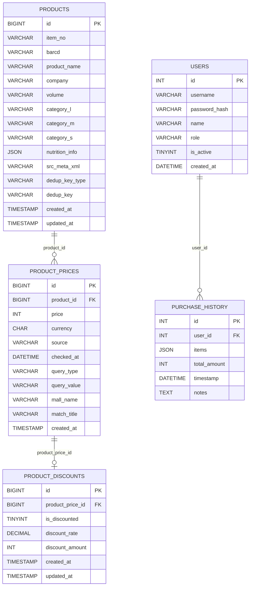

# mydb Schema (2026-02-24)

```mermaid
erDiagram
    PRODUCTS {
        BIGINT id PK
        VARCHAR item_no
        VARCHAR barcd
        VARCHAR product_name
        VARCHAR company
        VARCHAR volume
        VARCHAR category_l
        VARCHAR category_m
        VARCHAR category_s
        JSON nutrition_info
        VARCHAR src_meta_xml
        VARCHAR dedup_key_type
        VARCHAR dedup_key
        TIMESTAMP created_at
        TIMESTAMP updated_at
    }

    PRODUCT_PRICES {
        BIGINT id PK
        BIGINT product_id FK
        INT price
        CHAR currency
        VARCHAR source
        DATETIME checked_at
        VARCHAR query_type
        VARCHAR query_value
        VARCHAR mall_name
        VARCHAR match_title
        TIMESTAMP created_at
    }

    PRODUCT_DISCOUNTS {
        BIGINT id PK
        BIGINT product_price_id FK
        TINYINT is_discounted
        DECIMAL discount_rate
        INT discount_amount
        TIMESTAMP created_at
        TIMESTAMP updated_at
    }

    USERS {
        INT id PK
        VARCHAR username
        VARCHAR password_hash
        VARCHAR name
        VARCHAR role
        TINYINT is_active
        DATETIME created_at
    }

    PURCHASE_HISTORY {
        INT id PK
        INT user_id FK
        JSON items
        INT total_amount
        DATETIME timestamp
        TEXT notes
    }

    PRODUCTS ||--o{ PRODUCT_PRICES : product_id
    PRODUCT_PRICES ||--o| PRODUCT_DISCOUNTS : product_price_id
    USERS ||--o{ PURCHASE_HISTORY : user_id
```

## Row Counts

| Table | Rows |
|---|---:|
| products | 264 |
| product_prices | 161 |
| product_discounts | 168 |
| users | 0 |
| purchase_history | 0 |
